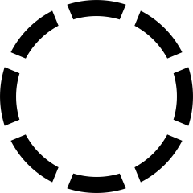
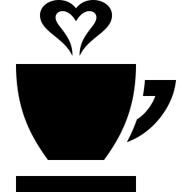
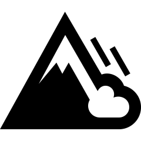
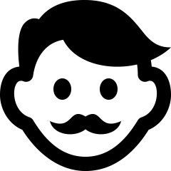

---

Welcome 🪴, based (and born) in sunny Barcelona  I have been working as a Front-end for about 6 years... 💭

### Fields of Interest

- Newest stuff of **Javascript** and **Typescript**
- **Design systems** and component libraries
- **React** ⚛ architecture patterns and monorepo architecture
- **Integration testing** (these days mostly with Cypress)

### Philosophy

1. KISS (keep it simple stupid)
2. DOT (do one thing well)
3. FP (and keep it light)
4. Declarative > Imperative code

### Other

 Ancient Buddhism (Theravada)  
 Speciality Coffee  
 Hiking and climbing  
 Minimalism  
 Climate first  
 He / him  

### Reach me at

 [hi@llu.lu](mailto:hi@llu.lu)
 [Twitter](https://twitter.com/_lluia)
